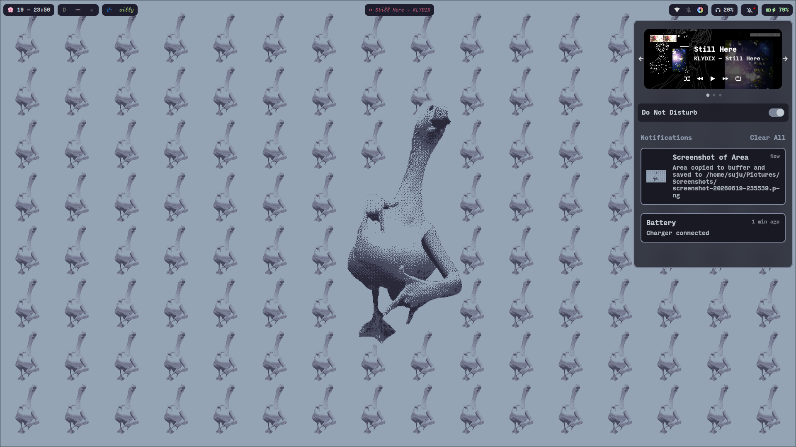
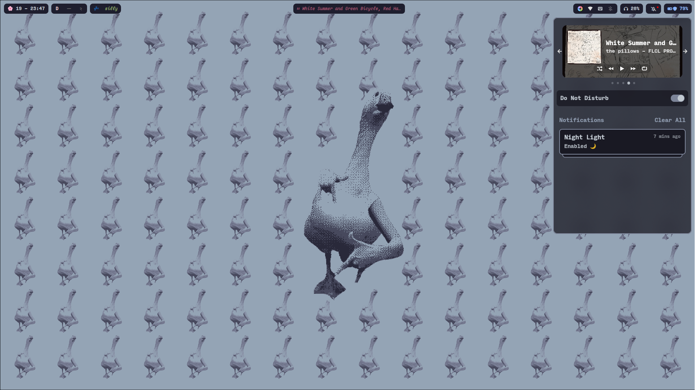

# 🌸 hyprbliss

_a rice that's simple beautiful and productive<3_

---

---
## Preview

---

hyprbliss is my personal rice designed for zenbook duo, it's simple, looks good and works well for my workflow.

|                 |                                                       |
| --------------- | ----------------------------------------------------- |
| **os**          | Arch Linux                                            |
| **wm**          | [Hyprland](https://hypr.land/)                        |
| **launcher**    | [rofi](https://github.com/davatorium/rofi)            |
| **terminal**    | [kitty](https://sw.kovidgoyal.net/kitty/)             |
| **shell**       | zsh                                                   |
| **editor**      | [neovim](https://neovim.io/)                          |
| **font**        | [Input Mono](https://input.djr.com/) & [Maple Mono](https://github.com/subframe7536/maple-font)                  |
| **wallpapers**  | [wallpapers](wallpapers)

---
